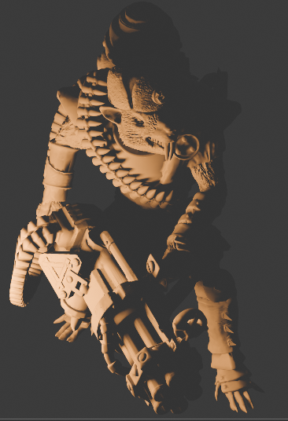
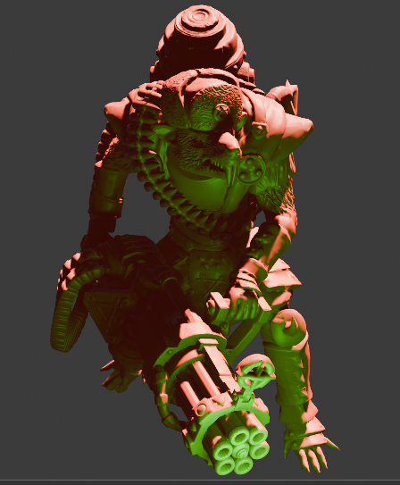
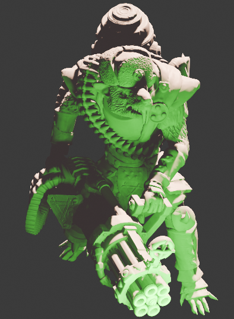

# Свечение из объекта (Object Source Lighting)

Техника добавления вторичного источника света, который может находится как на миниатюре, так и рядом с ней.

Плюсы:

- размещает миниатюру в реальном мире за счет добавления реалистичного света;
- добавляет точку фокуса на миниатюре;
- хороший способ показать свои навыки на соревнованиях.

Минусы:

- лучше всего работает с миниатюрами, размещенными при плохом освещении (например, ночью), поэтому редко используется для красочных, хорошо освещенных армий;
- нужно заранее определиться с источниками света, цветами миниатюры и отражениями;
- требует плавных переходов.

Состоит из следующих шагов:

1. Чтобы помочь визуализировать источник света, воспользуйтесь программами для манипуляций изображениями или для 3D моделирования. Например, [GIMP](https://www.gimp.org/), [Photoshop](https://www.adobe.com/ru/products/photoshop.html) или [Blender](https://www.blender.org/).
    
2. определите:
    
    - Цвет, расположение и площадь источника света. Красное пламя костра за пределами миниатюры и синяя плазменная катушка на оружии будут по-разному влиять на окружение.
        
        
        
        
        
    - Окружение источника. При ярком солнечном освещении ваш источник света будет не так заметен, как при ночном. Хорошим выбором будет контрастирующее по цвету основное освещение.
        
        
        
        
        
    - Цвет поверхностей рядом с источником света. От этого будет зависеть то, насколько цвет источника будет заметен - цвета с добавлением черного, белого и серого справятся с этим лучше.
        
        
        
        
        
    - Определите границу между основным и вторичным источниками света - темную линию, которая будет разделять разное освещение для более драматического эффекта.
        
        Например, ярко-красный космодесантник с плазменным пистолетом голубого цвета в руках. Перед тем, как рука с оружием начнёт окрашиваться в синий от свечения, броня должна будет окраситься в темно-красный для создания границы.
        
        
        
3. Покрасьте миниатюру как обычно, оставляя черными поверхности, затронутые освещением из объекта и его.
4. Покрасьте источник света, если он есть. Начните с самого темного оттенка, который вы можете себе позволить для данного объекта и плавно переходите к наиболее светлому, почти белому.
    
    

    💡 Покрасьте самую светлую часть источника в белый и затем покрыть его флюоресцентной краской или лессировкой нужного цвета. Так у вас получится наиболее яркая точка на миниатюре и вы не потеряете цвет источника.
    
    
    
    Вы также можете кроме тонального перехода сделать цветовой. Просто посмотрите ближайшие справа или слева к желаемому цвета на цветовом колесе. Например, вместо перехода **тёмно-зелёный → зеленый → светло-зеленый → белый** вы можете сделать **темный сине-зеленый → зеленый → желто-зеленый → желтый → белый**.
    
    
    💡 Поверх белого цвета нанесите глянцевый лак — так он будет отражать больше света и может скрыть не плавные переходы.
    
    
    
5. Покрасьте затронутые источником света его самым темным цветом. Предполагается, что в тени цвет материала будет малозаметен.
6. Смешайте цвет материала поверхности с цветами источника и начните красить также, как если бы вы красили миниатюру при помощи хайлатов. Помните, что:
    - интенсивность света снижается по квадратичному закону — так свет, находящийся в двух метрах от источника будет в четыре раза менее заметным;
        
        
        
    - свет всегда распространяется по прямым линиям - если между источником и поверхностью есть другой объект, то свет на нее влиять не будет;
    - свет на поверхностях не может быть ярче источника.