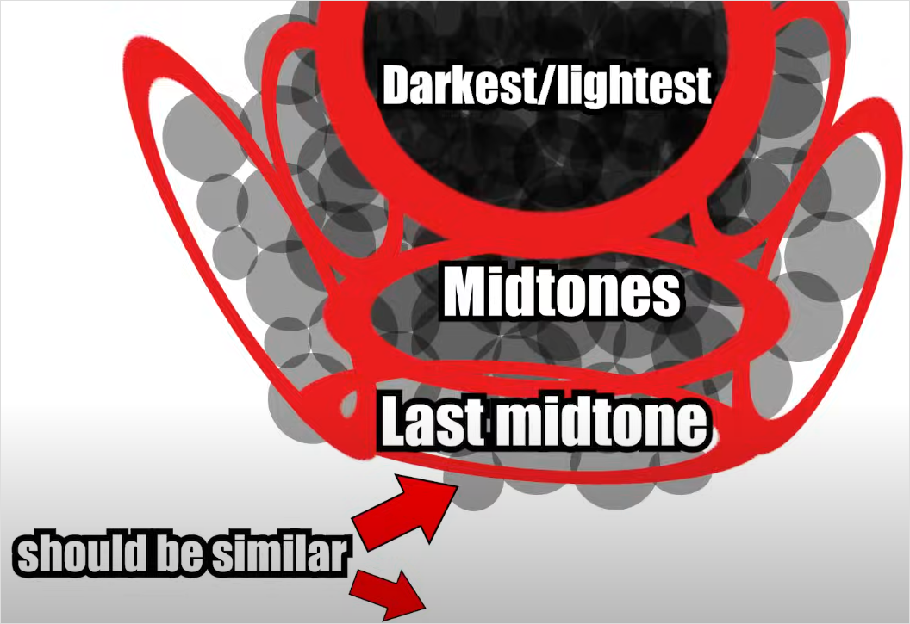

# Точечная штриховка (stippling)

Метод создания плавных переходов между цветами с созданием текстуры. 



💡 При выборе цветов старайтесь выбирать те, которые близки по цветовому тону, насыщенности или светлоте — такие цвета смешивать легче.



Плюсы:

- быстрее [лессировки](glazing.md);
- легкий в освоении и применении;
- создает текстуру, которая делает плоские поверхности более интересными (например, ткань и кожа).

Минусы:

- переходы видны лучше, чем при других методах;
- создает текстуру там, где она может быть не нужна;
- требует терпения;
- негативно влияет на кончик кисти;
- очень скучный.

Состоит из следующих шагов:

1. При помощи [наслаивания](layering.md) определите основные границы цветов.
2. Точечно нанесите на границу двух цветов разбавленную водой краску одного из них. Чем прозрачнее краска у вас получится, тем плавнее у вас получатся переходы, но это займет больше времени.
3. Повторите эти шаги для всех границ до плавного результата. Переходите к кистям с более острым кончиком для небольших плоскостей.
4. (Опционально) Используйте [лессировку](glazing.md), чтобы еще больше сгладить переходы.

Вы также можете не использовать наслаивание, а сразу начать точечно штриховать цвета. Так у вас получится более выраженная текстура, но вы потратите больше времени.

