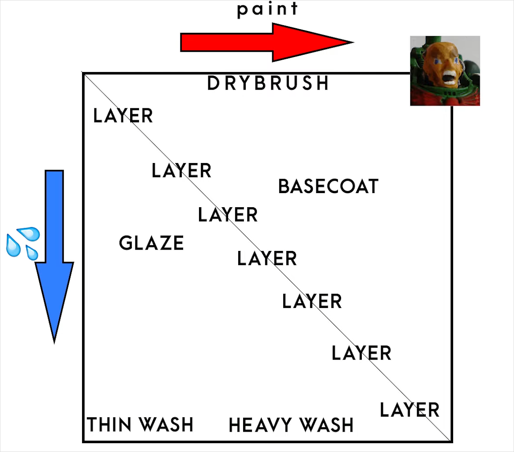

# Разведение краски

Всегда разбавляйте краски водой или специальными разбавителями, иначе мазки от краски повлияют на скульптуру миниатюры.

Все краски разные и иногда отличаются по консистенции даже внутри продуктов одного бренда, поэтому точные пропорции нужно подбирать самостоятельно. Однако в среднем отношения краски к воде или разбавителю можно использовать так:

- 1:0 — для влажного смешивания и создания текстуры;
- 10:1 — для [драйбраша](../methods/drybrush.md);
- 1:1 — для нанесения базового слоя;
- 1:2 — для [наслаивания](../methods/layering.md);
- 1:3 - 1:7 — для [лессировки](../methods/glazing.md);
- 1:10 — для проливки.

