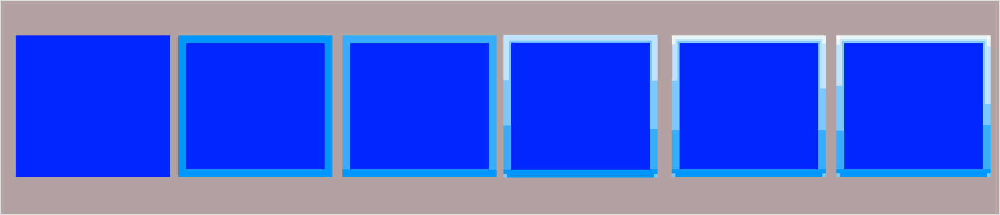

# Высветление краев (edge highlight)

На гранях и краях формы отражается большее количество света, чем на плоскости. Метод усиливает этот эффект за счет их высветления. Похожих результатов помогает добиться [сухая кисть](drybrush.md).

Плюсы:

- улучшает читаемость скульптуры;
- добавляет цветовую вариативность;
- усиливает контраст;
- хорошо подходит для острых граней и [NMM](non-metalic-metal.md).

Минусы:

- требует внимания и усидчивости;
- Занимает много времени;
- плохо работает на скульптурах с округлыми формами (например, тела людей и животных).
  
Высветление краев можно сделать быстро или качественно. 



- Быстро

    1. Определите грани, которые нужно высветлить. Сконцентрируйте внимание на смотрящих вверх гранях у лица, рук, груди и других важных для вас деталях.
    2. Выберите краску более яркого оттенка основного цвета поверхности. Например, для синего выберите голубой или бирюзовый.
        
        

        💡 Лучше всего для высветление краев подходят более густые краски, так как их легче контролировать.
        
        
        
        Не бойтесь смешивать цвета, если у вас нет подходящих красок. Вы можете добавить белый или желтый цвета к основному, чтобы получить нужный оттенок.
        
    3. Выберите кисть с острым кончиком. Попытайтесь подобрать кисть с настолько большим пучком, насколько вы можете. Так краска будет медленнее на ней засыхать.
    4. Поместите ваши локти на стол, соедините руки на подставке миниатюры. Так ваши руки будут максимально стабильны и вам будет легче рисовать тонкие линии.
    5. Наберите в кисть краску, уберите лишнюю влагу о бумажное полотенце и обрисуйте выбранные ранее грани. Не бойтесь вращать миниатюру для более удобной точки обзора и, если есть возможность, используйте не кончик кисти, а сторону нижней трети пучка — так красить грани гораздо легче.
        
        Старайтесь использовать длинные мазки кисти по всей грани вместо коротких штрихов для более чистого результата. 
        
- Качественно

    1. Определите все грани на миниатюре. Среди них определите:
        - грани, которые смотрят вверх;
        - грани, находящиеся у лица, рук и важных деталей модели.
        
        Эти грани вы будете выделять более яркими цветами, чтобы более реалистично передать игру света на миниатюре.
        
    2. Выберите как минимум две краски более яркого оттенка основного цвета поверхности. Например, для синего выберите голубой и светло-голубой. Вы можете увеличить количество цветов, постепенно переходя от основного цвета к белому и желтому, но вам потребуется большее количество шагов.
        
        

        💡 Лучше всего для высветления краев подходят более густые краски, так как их легче контролировать.
        
        
        
        Не бойтесь смешивать цвета, если у вас нет подходящих красок. Вы можете добавить белый или желтый цвета к основному, чтобы получить нужный оттенок.
        
    3. Выберите кисть с острым кончиком. Попытайтесь подобрать кисть с настолько большим пучком, насколько вы можете. Так краска будет медленнее на ней засыхать.
    4. Поместите ваши локти на стол, соедините руки на подставке миниатюры. Так ваши руки будут максимально стабильны и вам будет легче рисовать тонкие линии.
    5. Наберите в кисть первую по яркости краску, уберите лишнюю влагу о бумажное полотенце и обрисуйте все грани. Не бойтесь вращать миниатюру для более удобной точки обзора и, если есть возможность, используйте не кончик кисти, а сторону нижней трети пучка — так красить грани гораздо легче.
        
        Старайтесь использовать длинные мазки кисти по всей грани вместо коротких штрихов для более чистого результата. 
        
        Чтобы создать более реалистичный результат, вместо тонких, прямых мазков имитируйте царапины, трещины и другие неровности, за которые может зацепиться свет.
        
    6. Повторите процесс, но в этот раз используйте более яркую краску и покрасьте только выбранные грани. 
        
        Чтобы сгладить переход к более яркому цвету на грани, вы можете добавить дополнительные шаги перед этим, используя смесь текущего и предыдущего цветов и покрывая большую площадь.
        
        Например, покрасьте все грани в голубой цвет и, постепенно увеличивая количество белого в краске и уменьшая рабочую площадь, передвигайтесь к смотрящим вверх краям. 
        
        
        
        Для улучшения читаемости вы можете также увеличить яркость цвета на углах.


        

Чтобы улучшить результат, используйте высветление краев вместе с другими техниками. Например, [затемнение углублений](recess-shading.md) или высветление.