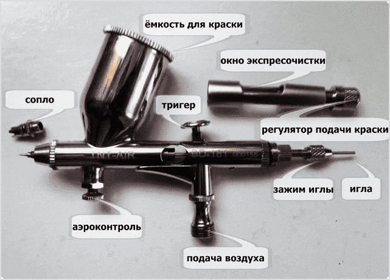
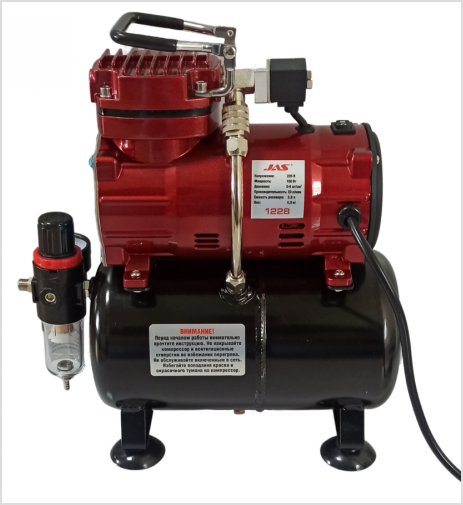

# Аэрограф

Если вы уже довольно долго занимаетесь росписью миниатюр, хорошим решением будет покупка аэрографа. Он поможет оптимизировать процесс и упростит многие этапы: грунтовка, лакирование, покрытие больших поверхностей.

Плюсы:

- быстрое нанесение красок;
- использование лаков и грунтовок в домашних условиях;
- создание плавных переходов;
- позволяет использовать [зенитальное высветление](../methods/zenithal-highlighting.md).

Минусы:

- новый инструмент, для которого нужно разрабатывать новый навык;
- комплект аэрографа и компрессора довольно дорогой;
- требует дополнительных инструментов: подставка, коробка для распыления, щетки и жидкость для чистки, перчатки и респиратор;
- нужно место для хранения и распыления, желательно с хорошей вентиляцией;
- нужно ухаживать и тщательно чистить;
- иглу и сопло легко повредить, поэтому часто требуется замена;
- сложно выбрать начальный аэрограф.

Чтобы начать работу аэрографом:

- познакомьтесь с устройством аэрографа;
- выберите аэрограф;
- выберите компрессор;
- выберите вспомогательные инструменты;
- научитесь разбавлять краску;
- научитесь чистить аэрограф;
- ознакомьтесь с алгоритмом росписи.

## Как устроен аэрограф

Аэрограф состоит из следующих компонентов:

- Игла — металлический стержень с острым концом, от диаметра которого зависит размер струи. Чем меньше радиус иглы, тем точнее наносить слои, но легче ее погнуть.
- Сопло — место, где соединяется поток воздуха и краски, и размер которого равен размеру иглы.
- Бачок для краски — куда наливается краска. Очень редко отсутствует в аэрографе.
- Пусковой рычаг — контролирует клапан подачи воздуха и положение иглы. Может выглядеть как рычаг или как спусковой крючок, если вместо традиционного форм-фактора ручки используется пистолетная рукоятка. По принципу действия есть двух типов:
    - одиночного — рычаг используется только для контроля воздуха, из-за чего конструкция проще и дешевле, но нельзя делать плавные переходы;
    - двойного — нажатием контролируется поток воздуха, а движением — положение иглы и расход краски;
    - автоматического — используется для спусковых крючков и нажатием сначала подается воздух, а затем — количество краски.
- Регулятор подачи краски — ограничивает максимальную длину, на которую может быть сдвинута игла, и максимальный поток краски. Не рекомендуется его использовать, так как уменьшение движения иглы может повлечь за собой скопление краски в сопле.
- Регулятор подачи воздуха (аэроконтроль) — вспомогательная часть, которая помогает контролировать силу потока воздуха на аэрографе, а не только на компрессоре. Есть не на всех аэрографах.
- Штуцер — резьба, к которой крепится шланг от компрессора.

## Как выбрать аэрограф

Для выбора аэрографа, определитесь с:

- Диаметром сопла и иглы:
    - для грубых работ (грунтовка, покрытие лаком, покрытие больших поверхностей) подойдут диаметры 0.8-0.4 мм;
    - для деталей — 0.3-0.1 мм;
    - для большинства задач — 0.3-0.4 мм.
    
    Рекомендуется брать иглы от 0.3 мм, чтобы риск погнуть иглу был минимален.
    
    Иногда вместе с аэрографом предоставляются сменные сопла и иглы меньшего диаметра, чтобы менять точность малых диаметров на прочность больших и наоборот.
    
- Расположением бачка:
    - верхнее — самое распространенное, простое и надежное;
    - боковое — позволяет более точно направлять аэрограф, так как не взору;
    - нижнее — подойдет для очень объемных работ, менять краску сложнее, если нет сменного бачка, держать и контролировать аэрограф тяжелее.
- Принципом действия: всегда выбирайте двойной или автоматический. Пусть научиться аэрографом будет сложнее, чем с одиночным, но он будет более полезен.
- Размером бачка: выбирайте максимальный объем, который вам может пригодиться. Лучше выбрать больше, чем меньше, чтобы в будущем не быть ограниченным размером.
Иногда бачки бывают съемными, чтобы легче контролировать объем краски.
- Диаметром штуцера: лучше выбрать G1/8”, который подойдет для большинства шлангов и компрессоров. Если выбрать другой, то придется покупать переходник или специализированный шланг.
- Наличием регулятора подачи воздуха: он удобнее, чем переключение давление на компрессоре, но далеко не обязателен.
- Ценой: для начала лучше выбрать дешевый аэрограф, для которого легко найти запчасти. Так его не будет жалко испортить и починить во время знакомства с инструментом.

Оптимальным начальным аэрографом будет:

- с диаметром сопла и иглы 3-4 мм;
- верхним или боковым расположением бачка;
- двойного действия;
- с размером бачка 2-8 мл;
- с диаметром штуцера G1/8”;
- с возможностью купить новые детали.

## Как выбрать компрессор

Компрессор нагнетает воздух в аэрограф — иначе распылять краску не получиться.

Компрессоры отличаются по:

- Максимальному давлению — чем выше, тем с большим диаметром сопла может работать компрессор. Для большинства задач подходит компрессор с давлением 4-6 атм (бар).
- Производительности — сколько воздуха может нагнетать компрессор за единицу времени. Чем она больше, тем стабильнее будет поток воздуха, а при наличии ресивера — тем меньше времени будет работать компрессор. Обычно масленые компрессоры производительнее, но для них нужно особое обслуживание.
- Наличию и объему ресивера — это емкость, которая хранит в себе сжатый воздух. Позволяет компрессору работать не все время, а только когда в ресивере падает давление.
- Наличию регулятора давления — нужен для настройки потока краски. Чем гуще краска, тем большее давление и расстояние требуется для ее распыления. И наоборот — чем текучее краска, тем меньшее давление и расстояние нужно.
- Наличию емкости для сбора влаги — собирает влагу, которая попадает в шланг. Так вода не попадет в детали компрессора.
- Шуму — компрессор шумит, когда он нагнетает воздух. Чем меньше шум, тем приятнее работать с инструментом. Допустимым уровнем будет 40-50дб.
    
    Ресивер уменьшает шум, так как период нагнетания воздуха меньше, и компрессор работает периодически — как холодильник.
    

Так как компрессор гораздо дороже, чем аэрограф, лучше всего выбрать
решение, которое прослужит долго и с которым будет наиболее удобно работать.

Наилучшим будет компрессор:

- безмасленый;
- с максимальным давлением 6 атм (бар);
- производительностью 20-25 л/мин;
- с трехлитровым ресивером;
- с регулятором давления;
- с емкостью для сбора влаги;
- шумом не более 50 Дб.

Для подключения аэрографа к компрессору используется шланг с соответствующим диаметром штуцера.

Стоит упомянуть, что существуют наборы аэрограф+мобильный компрессор.
Пусть они и дешевы, но их долговечность и область применения сомнительны.

## Какие вспомогательные инструменты могут понадобиться

Для работы с аэрографом пригодятся:

- Разбавитель и улучшитель потока для аэрографа (Airbrush Thinner и Airbrush Flow Improver) — разбавляют краску без потери покрывистости, насыщенности и прочности красок, одновременно с этим уменьшая поверхностное натяжение.
- Подставка для аэрографа — во время смешивания красок или перерывов в распылении держит аэрограф, чтобы содержимое бачка не пролилось.
    
    В качестве подставки можно использовать специальную емкость для очищения — так не только можно держать аэрограф, но и чистить
    его после работы.
    
- Емкость для смешивания красок — если смешивать краску сразу в бачке аэрографа, то более тяжелая краска протечет внутрь аэрографа, не смешается с водой или разбавителем и закупорит сопло. Чтобы этого избежать, краску лучше смешивать в небольшой емкости и переливать смесь из нее.
- Жесткая кисть для смешивания краски — подойдет дешевая старая синтетическая кисть, которая уже отжила свое и ее не жалко.
- Щеточки для чистки аэрографа — чтобы можно было глубже проникнуть в каналы аэрографа и почистить их от краски.
- Жидкость для чистки аэрографа — иногда просто воды не хватает, чтобы избавиться от засохшей краски. Для этого на помощь придет специальная жидкость. Она также помогает очистить аэрограф без его разборки.
- Спирт — используется когда даже жидкость для чистки не помогает, или если были использованы не водорастворимые краски. Не замачивайте аэрограф в спирте, так как это разрушит резиновые прокладки внутри.
- Смазка для аэрографа — восстанавливает подвижность деталей.
- Спрей батл — чтобы добавлять воду в краску и чистить аэрограф.
- Виниловые, латексные или нитриловые перчатки — чтобы защитить руки от краски.
- Респиратор — нужен для защиты органов дыхания от токсичных жидкостей. Для безопасных акриловых красок достаточно использовать медицинскую маску.
- Коробка для распыления — чтобы не распылять краску по всей комнате и частично фильтровать воздух. Профессиональные боксы стоят дорого, но их можно заменить самодельными из картонной коробки или пластикового контейнера — тогда в роли фильтра можно использовать мокрое полотенце, прикрепленное к отверстию на задней части бокса.
- Емкость для слива грязной воды.

## Как разбавить краску

Для того, чтобы краска беспрепятственно проходила через узкое сопло аэрографа, ее нужно сильнее разводить, чем для работы кистью.

Чтобы сократить шансы на закупорку, размешивать краску лучше в отдельной емкости. Если налить разбавитель и краску в бачок аэрографа, краска опустится вниз и зальется в сопло.

Разбавление состоит из следующих шагов:

1. Определите, сколько краски вам нужно разбавить.
2. Добавьте жидкость для разбавления краски и улучшитель в емкость в соотношении, указанном на упаковке. Разбавители добавляются первыми, чтобы краска не имела возможности засохнуть.
3. Добавьте нужный объем краски и перемешайте вместе с разбавителем при помощи кисти.
4. Возьмите часть краски при помощи кисти и попробуйте ее на невпитывающей поверхности.

Если краска слишком густая, добавьте воды и размешайте — лучше всегда сделать краску более прозрачной, чем рисковать закупоркой.

Также вы можете разбавить краску побольше, чтобы делать более прозрачные слои. Учтите, что для более жидкой краски понадобиться меньшее давление.

После этого краску можно добавлять в аэрограф и использовать для росписи.

## Как чистить аэрограф

Акриловая краска, особенно грунтовка, может прочно осесть на деталях аэрографа. Если их не почистить сразу, то они могут ухудшить работу аэрографа и в будущем попасть в сопло и закупорить его. Чтобы этого избежать, аэрограф нужно легко чистить после смены краски и после использования.

Чтобы почистить аэрограф от краски:

1. Вылейте краску из бачка в емкость для грязной воды.
2. Промойте бачок водой из спрей батл. Если к стенкам бачка прилипла краска, отскребете ее при помощи кисти. Повторите, пока вода в бачке перестанет приобретать цвет.
3. Посмотрите в сопло аэрографа. Если на нем или на игле осталась краска, соскребите ее при помощи кисти.
4. Пропустите немного воды через аэрограф. Если из вода все еще окрашивается в цвет краски, повторите шаги 2-4 несколько раз.
5. Если это не помогло, разберите сопло и достаньте иглу. Промойте сопло, корпус аэрографа и осторожно протрите иглу. Соберите аэрограф.

## Как использовать аэрограф

1. Подключите аэрограф к компрессору при помощи шланга.
2. Включите компрессор.
3. Дождитесь, пока компрессор нагнетет нужное давление в пределах 1.5-3 атм (бар). Для более густых красок используйте большее давление, чем для более жидких. Чтобы его скорректировать, используйте регулятор давления.
4. Добавьте небольшое количество воды в аэрограф, нажмите на пусковой рычаг и отодвиньте назад, чтобы избавиться от остатков краски, если они есть.
5. Добавьте разбавленную краску в бачок аэрографа.
6. Попробуйте краску на какой-нибудь поверхности. Чтобы нанести краску:
    1. Нажмите на рычаг, чтобы подать воздух в аэрограф до того, как в сопло попадет краска. Иначе она неравномерно разбрызгается по окрашиваемой поверхности.
    2. Не ослабляя давление на рычаг, отведите его назад, чтобы добавить краску в сопло. Чем дальше вы отведете рычаг, тем больше краски будет распылять аэрограф.
    3. Посмотрите на результат распыления:
        - Если краска распылилась неравномерными пятнами, значит краска слишком густая или давление слишком низкое.
            - Для более точного результата разбавьте краску.
            - Для непрозрачного покрытия увеличьте давление.
        - Если краска начала растекаться паутинкой, то уменьшите давление или распыляйте дальше от поверхности.
            - Для более точного результата уменьшите давление.
            - Для покрытия большей площади, отдалите аэрограф дальше от распыляемой поверхности.
7. Чтобы завершить распылять краску, передвиньте рычаг вперед и прекратите нажимать на него. Если сначала остановить поток воздуха, а потом краски, то краска вытечет в сопло и при следующем использовании она неравномерно разбрызгается.
8. Покройте нужную поверхность краской из аэрографа так же, как на шагах 5.1. - 5.4.
9. Почистите аэрограф от краски.
10. Повторите шаги 3-8 для нанесения других красок.
11. Выключите компрессор. Выпустите сжатый воздух при помощи специального клапана, через аэрограф или просто открутив шланг.