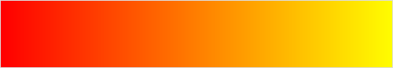
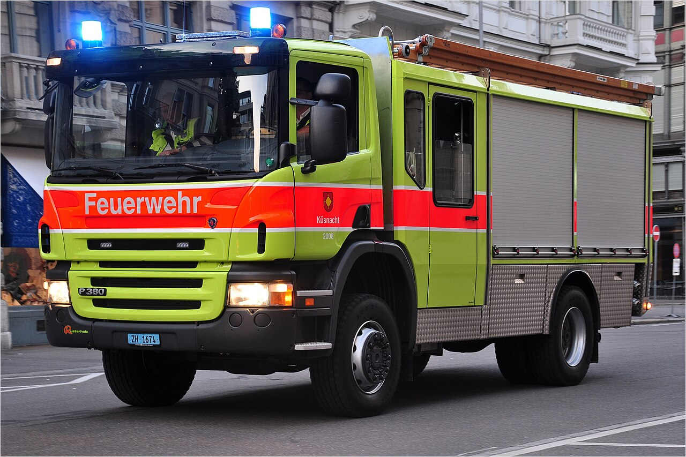

# О цветах

## Описание цветов

В этом разделе описаны особенности, сочетания и культурное значение цветов:

#|
|| **Цвет** | **Особенности** | **Сочетания**| **Культурное значение**||
|| **Красный** 🟥|

- Красный доминирует над оранжевым и фиолетовым. Даже если вы оставите совсем немного красного между фиолетовыми тенями и оранжевыми высветлениями поверхность будет читаться красной.
- Придает жизнь не только человеческой, но и фентезийной коже. Например, розовый на щеках орка смотрится гораздо интереснее и живее, чем просто зеленый.
- Красный цвет сильно выделяется, поэтому используйте его умеренно и сбалансировано. Размещайте его на важных местах на миниатюре и не концентрируйте в одном месте — например, используйте три фокусные точки.
- Акриловые краски этого цвета очень прозрачные, поэтому подложка сильно влияет на конечный результат.
- Красный очень прозрачный, поэтому хорошо подходит для лессировки. За счет этого вы можете нанести краску для высветления и сделать градиент нанеся красный сверху.
- Матовый красный выглядит менее насыщенным, чем глянцевый. Поэтому после высыхания он выглядит менее интересным, чем сразу после нанесения. Чтобы вернуть насыщенность, добавьте высветления при помощи лессировки.
|
- Дополнительный цвет — зеленый. Используйте его для реалистичных теней и контрастных высветлений.
- Для теней используйте синий (для сильного контраста), фиолетовый (для более дорогих и насыщенных теней), зеленый (для более реалистичных) и коричневый (для ненасыщенных и грязных).
- Для высветлений используйте оранжевый, светлые тона кожи и пастельный желтый.
  
    Если для высветлений использовать белый, то поверхность будет читаться розовой и сделать плавный переход будет сложнее.
|
- Активность
- Дружелюбие
- Уверенность
- Гнев
- Ярость
- Кровь
- Сила
- Угроза
- Вожделение||
|| **Оранжевый** 🟧|

- Оранжевый отвечает за небольшой участок цветового диапазона. Слишком много красного или желтого и оранжевый уже не читается таковым.
  
- У оранжевого есть натуральная флуоресцентная краска.
- Оранжевый цвет сильно выделяется, поэтому используйте его умеренно и сбалансировано. Размещайте его на важных местах на миниатюре и не концентрируйте в одном месте — например, используйте три фокусные точки.
- Акриловые краски этого цвета очень прозрачные, поэтому подложка сильно влияет на конечный результат.
  
    Используйте яркую и теплую подложку. Например, ржавый и желтый тон кожи.

- Получается из смеси красного и желтого.
- Настоящий оранжевый пигмент ярче, чем смесь красного и желтого.
- Оранжевый очень прозрачный, поэтому хорошо подходит для лессировки. За счет этого вы можете нанести краску для высветления и сделать градиент нанеся оранжевый сверху.
|

- Дополнительный цвет — сине-зеленый. Используйте его для реалистичных теней и контрастных высветлений.
- Для теней используйте сине-зеленый, синий, фиолетовый, ржавый и коричневый.
- Для высветлений используйте светлые тона кожи, сине-зеленый
- Чтобы сделать оранжевый менее насыщенным, добавьте в него синий.
|
- Пламя
- Солнце
- Развлечение
- Предупреждение
- Видимость
- Буддизм
- Осень
- Инженерное искусство
||
|| **Желтый** 🟨|

- Самый яркий цвет на световом колесе.
- Желтый цвет сильно выделяется, поэтому используйте его умеренно и сбалансировано. Размещайте его на важных местах на миниатюре и не концентрируйте в одном месте — например, используйте три фокусные точки.
- Акриловые краски этого цвета очень прозрачные, поэтому подложка сильно влияет на конечный результат.

    На холодные цвета желтый ложится плохо и принимает зеленоватый цвет. Используйте яркую и теплую подложку. Например, ржавый и желтый тон кожи.

- Может восприниматься как теплый или холодный в зависимости от окружающих цветов.

|

- Дополнительный цвет — фиолетовый. Используйте его для реалистичных теней и контрастных высветлений. Фиолетовый цвет очень сильный, поэтому используйте малое его количество для смешивания теней и высветлений.
- Для теней используйте ржавый, фиолетовый и темные тона кожи.
- Для высветлений используйте светлые тона кожи, пастельный лиловый и желтый.
|

- Солнце
- Золото
- Богатство
- Продажность
- Обман
- Старость
- Оккультизм
- Предупреждение
||
|| **Зеленый** 🟩|
- Получается из смеси синего и желтого цветов.
- Глубокий зеленый хорошо подходит для лессировки.
- Отвечает за большой спектр цветов.
|

- Дополнительный цвет — красно-фиолетовый. Используйте его для реалистичных теней и контрастных высветлений.
- Для теней используйте фиолетовый, синий.
- Для высветлений используйте желтый, розовый.
- Используйте коричневый для создания грязного ощущения. Например, камуфляж или грязная роба.
- Используйте оранжевый или желтый для создания опасного ощущения.  Например, цвет радиоактивного излучения или [цвет пожарной машины в некоторых частях мира](https://en.wikipedia.org/wiki/Chartreuse_(color)#Firefighting) (Wikipedia).

    
- Используйте синий для создания искусственного ощущения. Например, патина или пластик.
|

- Трава
- Природа
- Деньги
- Изумруд
- Радиация
- Весна
- Свежесть
- Надежда
- Юношество
- Неопытность
 ||
|| **Сине-зеленый** 🧼|
- Получается из смеси синего и зеленого.
- В это семейство цветов входят бирюзовый и цвет морской волны.
- В мире различаются бирюзовый (turquoise — по названию минерала [Бирюза](https://ru.wikipedia.org/wiki/%D0%91%D0%B8%D1%80%D1%8E%D0%B7%D0%B0) (Wikipedia)) и темно-сине-зеленый (teal — по названию утки [Eurasian teal](https://en.wikipedia.org/wiki/Eurasian_teal) (Wikipedia)) цвета. В русском такое различие применяется не часто.

|

- Дополнительный цвет — красно-оранжевый. Используйте для естественных теней (получится тепло-серый) и высветлений (получится зеленоватый).
- Для теней используйте фиолетовый и темно-сине-зеленый.
- Для высветлений используйте белый, лиловый, холодный желтый и телесные цвета. Например, персиковый.
- Хорошо подходит для окисления меди и бронзы. Можете добавить немного сине-зеленого в тени даже не окисленной меди, чтобы добавить интереса поверхности.
|

- Холодный
- Море
- Расслабленность
- Сонливость
- Окисление
- Будущее
||
|| **Синий** 🟦|

- Холодный цвет.
- Слово для синего появилось позже остальных. Синие пигменты наиболее редки.
- Синий цвет сильно выделяется, поэтому используйте его умеренно и сбалансировано.
- Средний синий и темно-синий хорошо подходят для лессировки. Светлый синий содержит много белого пигмента, поэтому плохо подходит для фильтра.
|

- Дополнительный цвет — оранжевый. Используйте для естественных теней (получится тепло-серый) и высветлений (получится желтый).
- Для светлых оттенков синего используется белый цвет, придающий непрозрачность краске. Из-за этого слои высветления этим цветом очень выделяются и ими сложно сделать градиент.
- Для высветлений используйте патину, пастельно-желтый или розовый телесный цвета.
- Для теней используйте сине-зеленый, фиолетовый, темно-красный и черный.
|

- Море
- Холод
- Грусть
||
|| **Фиолетовый** 🟪|
- Фиолетовый цвет сильно выделяется, поэтому используйте его умеренно и сбалансировано. Размещайте его на важных местах на миниатюре и не концентрируйте в одном месте — например, используйте три фокусные точки.

- Получается из смеси красного и синего цветов.
- Фиолетовый отвечает за небольшой участок цветового диапазона. Слишком много синего или красного и фиолетовый уже не читается лиловым или малиновым.
- Фиолетовый хорошо подходит для лессировки.

|

- Дополнительный цвет — желтый. Используйте его для реалистичных теней и контрастных высветлений. Желтый очень яркий, поэтому для теней вам потребуется добавить черный для более глубоких теней.
- Для высветлений вместо фиолетового с белым в смеси используйте пастельный сильный (для холодной поверхности) или тон кожи (для теплой). Краски с добавлением белого создадут слишком резкий переход и сделает высветление менее насыщенным.
- Для теней используйте сине-черный, желтый (для более натуральных теней).

|

- Монархия
- Богатство
- Роскошь
- Траур
- Духовенство
- Индивидуализм
- Свобода
- Достоинство

||
|| **Розовый** 🌺|

- Оттенок красного. Может содержать оттенки оранжевого, синего и мадженты.
- Часто виден в природе: закат, цветы, кристаллы, животные и тоны кожи.
- Акриловые краски этого цвета очень прозрачные, поэтому подложка сильно влияет на конечный результат.

    Используйте яркую подложку.

- Может восприниматься как холодный или теплый. Поэтому используйте яркую подложку любой температуры.
|
- Для высветлений используйте пастельные тона, например, Ice Yellow или тона кожи. Не используйте белый цвет. Его и так достаточно в розовом и он ослабляет влияние цвета.
- Для теней используйте сине-фиолетовый, темно-красный и темно-синий.
|

- Радость
- Счастье
- Обаяние
- Нежность
- Женственность
- Романтика
- Надежда
||
|| **Маджента**|

- Искусственный — нет световой волны, которая отвечает за него, и получается сложением двух волн из разных мест спектра.
- Акриловые краски этого цвета очень прозрачные, поэтому подложка сильно влияет на конечный результат.

    Используйте яркую подложку.

- Может восприниматься как холодный или теплый. Поэтому используйте яркую подложку любой температуры.

|

- Дополнительный цвет — приглушенный зеленый. Можете его использовать для естественных теней (получится темно-фиолетовый) и высветлений (получится холодный розовый).
- Для теней используйте сине-фиолетовый, темно-красный и темно-синий.
- Для высветлений используйте флюоресцентную мадженту, холодный желтый, розовый и белый.
- Можете использовать для добавления жизни и яркости на важные места миниатюры. Например, на щеки, чтобы привлечь внимание к лицу.
|

- Женственность
- Романтика
- Страсть
- Креативность
- Творчество
- Богатство
- Власть

||
|| **Коричневый** 🟫|

- Комфортный для глаз.
- Нейтральный. Используйте для того, чтобы не заваливать вашу работу яркими и более эффектными цветами.
- Получается из смеси красной, желтой и черной красок.
- Очень много цветов считаются коричневыми — от бежевого до хаки.
- Коричневая краска хорошо ложится.
- Коричневая краска легко смешивается.
|
- Люди пропускают коричневый цвет, когда смотрят на общую картинку. Используйте коричневый для направления взгляда на более важные детали миниатюры. 
- Дополнительный цвет определяйте зависимости от того, какой оттенок сильнее влияет на коричневый — желтый → фиолетовый, красный → зеленый, оранжевый → бирюзовый.
- Используйте коричневые цвета разных оттенков для создания контраста.
|

- Плодородие
- Приземленность
- Стабильность
- Осень

||
|| **Белый** ⬜️|

- Нейтральный.
- Ахроматичный — не передает информацию о цвете.
- Зрительно увеличивает пространство.
- Легко загрязняется другими цветами, поэтому он отражает цвета окружения. Например, белый будет читаться желтоватым при теплом освещении.
- Пигмент для белого часто больше других цветов. Поэтому белые краски часто имеют меловую текстуру и ими сложно создать ровный цвет и плавный переход.
- Не подходит для лессировки из-за большой непрозрачности.
|
- Белый цвет сложно положить ровным слоем. Чтобы упростить этот процесс, делайте подложку серого цвета.
- Чтобы упростить последний слой белого, смешайте его в пропорции 1:1 с глянцевым лаком. Так слой будет ярче и ровнее.
- Не используйте чисто белый цвет для поверхностей. Он скучный и плохо ложится. Используйте белый только для отражений на глянцевых и металлических поверхностях. Например, точка света на глазах, драгоценных камнях и кромке меча.
- Белые оттенки зависят от находящихся рядом цветов. Например, пастельные тона будут читаться как белый рядом с черным.
- Вместо белого для поверхностей используйте оттенки. Вместе с другими красками на модели они будут читаться как белый, несмотря на их принадлежность к цветам, и будут смотреться более интересно. Например, цвет слоновой кости (Ivory), теплый серый (Warm Grey) и белый (Warm White), телесные (Vampiric Flesh или Elfic Flesh), песочные (Pale Sand) и пастельные (Green grey, Pastel Blue или Pastel Violet) тона.
- Для большего контраста между светом и тенью, на переходах чередуйте теплые и холодные тона. Например, Bone White → Green Grey → Brainmatter Beige, Warm Grey → Elfic Flesh → Green Grey.
- Белый цвет ахроматичен, поэтому может использоваться в сочетании со всеми другими цветами как основной или нейтральный для разбивки основной палитры. 
|

- Чистота
- Целомудрие
- Честность
- Нейтральность
- Свет  
- Мир
- Добро
- Начало
- Религия
- Формальность
||
|| **Серый** 🐘|

- Нейтральный. Используйте для того, чтобы не заваливать вашу работу яркими и более эффектными цветами.
- Серым считается не только смесь черного и белого, но и оттенки цветов.
- В зависимости от добавления других цветов может считаться теплым или холодным.
- Светло-серый легко загрязняется другими цветами, поэтому он отражает цвета окружения. Например, будет читаться желтоватым при теплом освещении.
- Акриловые краски этого цвета часто содержат в себе синий пигмент. Он снижает насыщенность теплых цветов, поэтому не используйте черный в качестве подложки красного, оранжевого и желтого цветов.|
|
- Люди пропускают серый цвет, когда смотрят на общую картинку. Используйте серый для направления взгляда на более важные детали миниатюры.
- Чтобы добавить больше жизни, вместо смеси черного и белого используйте оттенки.
- Для теней и высветлений используйте серый разных температур, чтобы усилить контраст и сделать поверхность менее скучной. Например, холодные тени и теплые высветления. |

- Грусть
- Траур
- Депрессия
- Скука
- Старость
- Мудрость
- Скромность
||
|| **Черный** ⬛|
- Черный означает отсутствие цвета.
- Ахроматичный — не передает информацию о цвете.
- Матовый черный читается серым.
- Акриловые краски этого цвета часто содержат в себе синий пигмент. Он снижает насыщенность теплых цветов, поэтому не используйте черный в качестве подложки красного, оранжевого и желтого цветов.
|
- Чтобы добавить интереса на миниатюру, вместо черного старайтесь использовать его смесь с другими цветами. Например, с фиолетовым в AK Tenebrous Grey.
- Не используйте нейтральным серый цвет для высветления. Он не интересный и создает резкий переход между слоями. Для высветления черного используйте синий и фиолетовый цвета — они читаются самыми темными.
    Чтобы миниатюра смотрелась черной, высветляйте только края. Подробнее см. в разделе [Черная броня](../armor/black.md). 

|
- Зло
- Женская сексуальность
- Смерть
- Хаос
- Ночь
- Таинство ||
|#

## Небольшие заметки

- Коричневые пигменты: бистр, сепия, сиена, умбра и земля.
- Маджента получил свое название из-за красителя фуксина. Он использовался в качестве антисептика в битве при Мадженте в северной Италии.
- Пурпур — первый фиолетовый пигмент. Он добывается из морских улиток и высоко ценился в античности.
- Цветовое сочетание оранжевого и бирюзового часто видно на постерах и в цветовой гамме фильмов.

## См. далее

- [Плейлист Exploring Colors от Vince Venturella](https://youtube.com/playlist?list=PLcdsbwBroEmBfSAKcqpwBKIrYyepHtHN9&si=ZljLEx9aJg1GhUMP) (Youtube)
