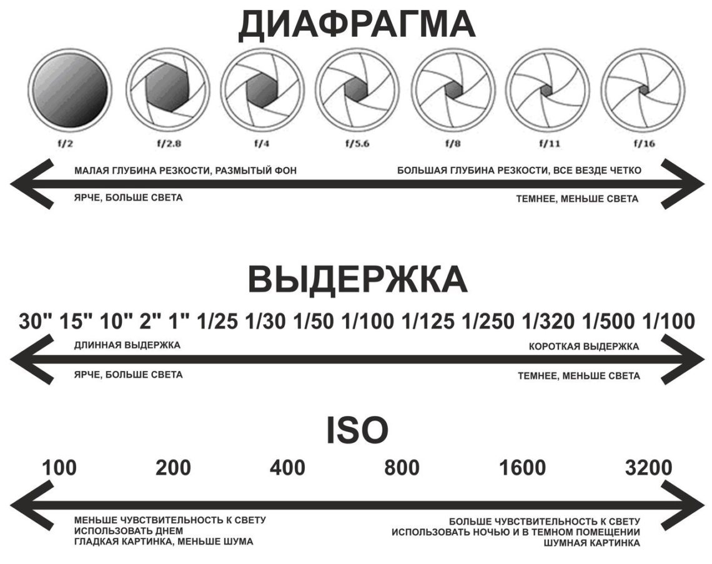

# Фотография миниатюр

Короткая памятка:

Дополнительные советы:

Добавлю:

- Протри и стабилизируй камеру.
- Убедись, что падающих теней нет и миниатюра везде одинаково освещена — особо часто между ног деталей не видно из-за тени.
- Цифровое увеличение убивает качество фото. Лучше пододвинь камеру ближе и обрежь ненужное потом в редакторе.
- Редактировать фото потом можно и нужно. Например, насыщенность некоторых красок на фото не передается, приходится увеличивать.
- Чтобы засветов и шума не было, но детали все еще были хорошо видны, пододвинь лампы ближе и понизь ISO (светочувствительность) до 100. Если все еще темно, начинай повышать ISO до приемлемого результата. Если можно поиграться с выдержкой, то сначала настрой ее, а потом перейди к настройке ISO.
- Если есть диафрагма на камере, убедись что все детали видны хорошо, а не только на переднем или на заднем плане.

## Видео руководства от Squidly Bits

@[youtube](https://youtu.be/YlkzRE33Lb0?si=tq_LxwOvxCYMcWYl)

## Видео руководства от Trovarion Miniatures

@[youtube](https://youtu.be/FpHYU7O48as?si=3CvM6kdaM8mbzM4P)

## Видео руководства от Vince Venturella

@[youtube](https://youtu.be/NCsWBTuJGJg?si=kYGy19ZNCAQ_XfVB)
