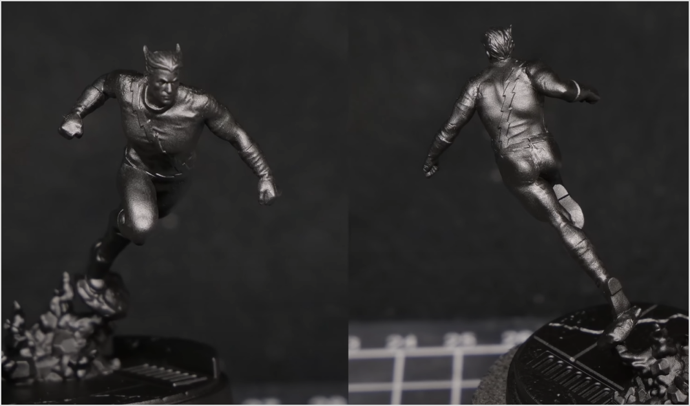
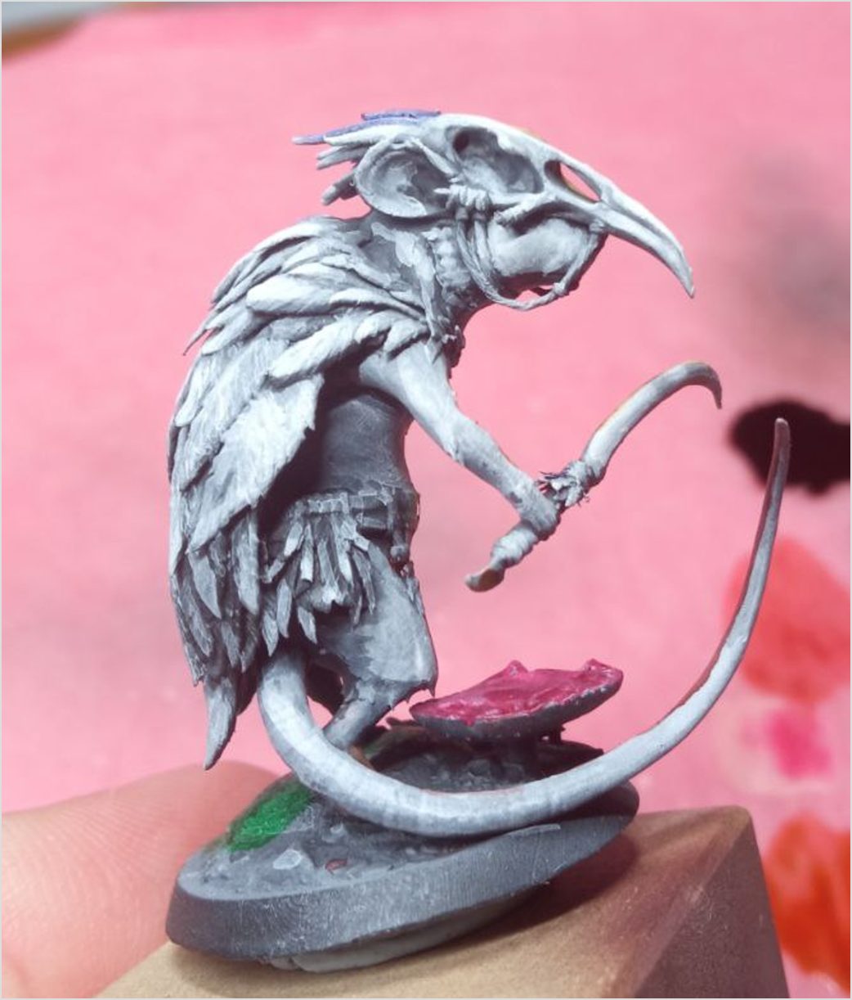
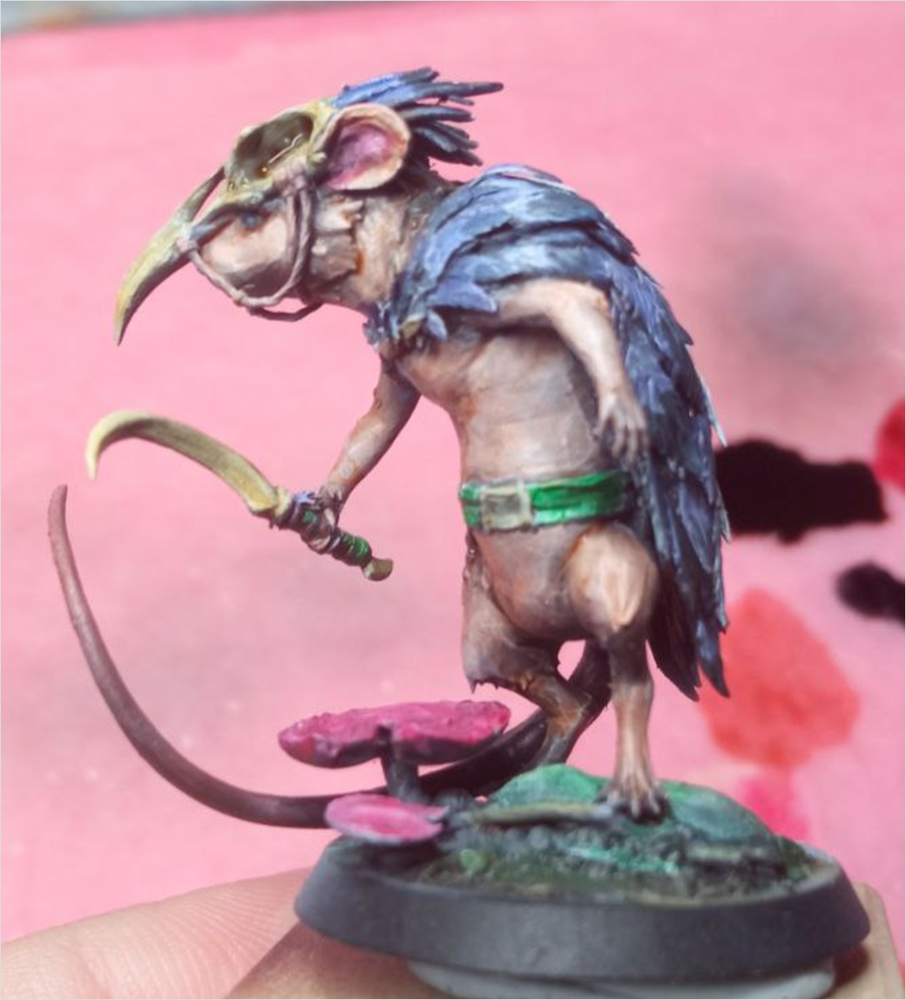
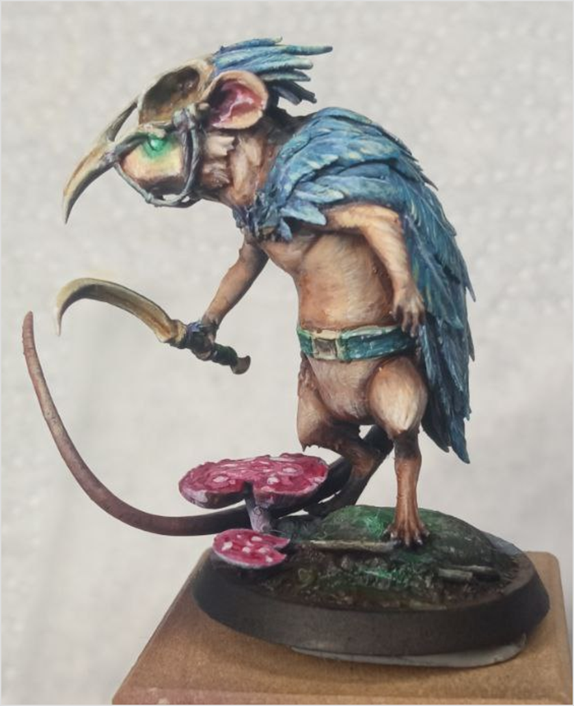

# Объемный скетч (Value Sketching)

Этот метод позволяет быстро создать грубый эскиз света и тени, но требует от художника знания света и объема.

Плюсы:

- предает миниатюре объем;
- позволяет познакомиться с рельефом миниатюры до росписи.

Минусы:

- занимает больше времени, чем простая грунтовка;
- требует знания объема, света и теней.

Метод состоит из следующих шагов:

1. Загрунтуйте миниатюру темной краской. Например, черной.
2. Определите места с основными отражениями света. На них потом будет нанесен наиболее светлый тон краски для придания объема.
    
    Чтобы определить отражения, вы можете сфотографировать миниатюру под разными углами под настольной лампой.
    
    
    
3. На эти места нанесите светлую краску, например, белую. Вы можете сделать это при помощи кисти (так будет точнее) или аэрографа (так переходы будут плавнее).
    
    Чернила позволяют нанести светлую краску в несколько слоев для создания градиентов и вариаций цвета.
    
    
    
4. Нанесите краски нужных цветов поверх получившегося скетча — наиболее светлые на уже покрашенные светлые места, наиболее темные — на все остальное.
    
    Очень полезными будут похожие на Contrast от Citadel краски. Они будут пропускать большое количество цветов под ними и вы не потеряете свою работу под непрозрачными слоями.
    
    
    
5. Продолжите работу: добавьте детали, исправьте ошибки, увеличьте потерянный контраст.
    
    
    

Вы можете делать скетч сразу нужными для миниатюры цветами и смешать их при помощи [влажного смешивания](wet-blending.md) — так будет быстрее, но работать будет сложнее.