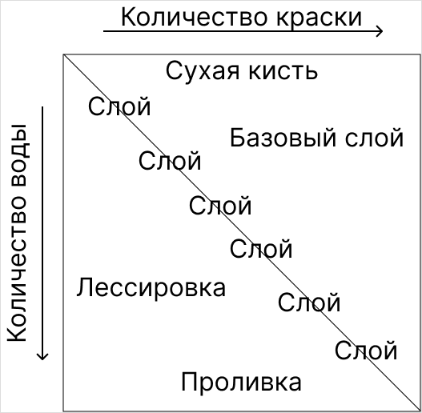

# Вредные советы

#|
|| **Вредный совет** | **Хороший совет**||
||



Перед тем как начать красить свою первую миниатюру, посмотрите все инструкции по всем техникам в этом непростом деле, чтобы сразу рисовать на высоком уровне.



|



Начинайте красить как можно раньше и как можно больше и вы достигните большего успеха.

Мастерство в росписи миниатюр достигается при помощи практики, которую не заменит даже самый большой объем теории.



||
||



Используйте краску прямо из баночки — так вы всегда сможете покрасить миниатюру одним слоем!



|



Смешивайте краску с водой или специальными разбавителями и наносите краску в несколько слоев, если вы все еще видите грунтовку.

В баночке краска зачастую слишком густая и при использовании без разведения будет оставлять мазки, портящие рельеф миниатюры.



||
||



Чтобы потом не жалеть о своей первой миниатюре, перекрашивайте ее пока у вас не получится та работа, которой вы будете гордиться.



|



Лучше красьте больше разных миниатюр.

Каждая миниатюра — это небольшая головоломка, и с каждой новой фигуркой вы тренируете поиск решения этой задачи. Если вы будете красить только одну миниатюру, вы научитесь хорошо красить только ее.

Если вы оставите свою первую фигурку покрашенной на полке, то вы сможете вернуться к ней позже, чтобы увидеть свой прогресс.



||
||



Не тратьте деньги на дорогую лампу — в конце концов, вам не нужен яркий свет, чтобы есть или подписывать документы.



|



Используйте яркую лампу с нейтральным рассеянным светом.

Она поможет не только разглядеть самые маленькие детали миниатюры, но и точно передать цвета.



||
||



Чтобы не смешивать цвета, приобретите сразу все краски, которые вам могут понадобиться в будущем.



|



Чтобы в начале сэкономить и не потеряться в огромном выборе красок, приобретите только основные цвета:

- черный и белый;
- желтый, красный и синий;
- зеленый, коричневый и телесный;
- железный металлик и коричневую проливку.

Вы потом поймете, какие цвета вам будут нужны, а от каких можно отказаться.



||
||



Купите побольше миниатюр, чтобы никогда не оказаться без “полотна” для ваших шедевров.



|



Покупайте только те миниатюры, которые вы будете точно готовы покрасить.

Каждая дополнительная миниатюра снизит вашу мотивацию и усложнит выбор для следующей работы. Постарайтесь контролировать ваши покупки.



||
||



Никогда не спрашивайте у других людей совета — они испортят ваше творческое видение или даже обидят вас своим недалеким мнением.



|



Постарайтесь узнать мнение других людей, даже тех, кто не увлекается миниатюрами.

Другие люди могут дать интересную идею которую вы могли не замечать. Люди, которые давно занимаются росписью могут дать дельный совет, который поможет вам справиться с вашими трудностями.



||
||



Всегда стремитесь к реализму, чтобы ваши миниатюры всегда выглядели как часть окружения.



|



Стремитесь не к реализму, а к интересным решениям.

Реалистичная роспись хорошо смотрится на реалистичных бюстах, но на маленьких миниатюрах с преувеличенными пропорциями она будет выглядеть неуместно. Красивую миниатюру можно покрасить и без затратного по времени реализма, сконцентрировав внимание на важных деталях и цветовых комбинациях.



||
||



Всегда начинай красить миниатюру с самого светлого цвета, ведь его сложнее всего красить.



|



Выбирайте базовый цвет на основе всех остальных цветов на миниатюре:

- Если вы используете похожие на Citadel Contrast краски, то светлая грунтовка упростит их нанесение.
- Используйте теплую грунтовку, чтобы упростить дальнейшее нанесение теплых цветов.
- Используйте [зенитальное высветление](methods/zenithal-highlighting.md), чтобы сразу создать тени на миниатюре.
- Красить кожу лучше всего с самого темного ее оттенка, чтобы затем наращивать светлоту при помощи лессировки
- Темный тон грунтовки позволяет не красить самые темные детали миниатюры.



||
||



Никогда не мой миниатюру перед грунтовкой, ведь их всегда обрабатывают на фабрике.



|



Всегда мойте миниатюру в воде со средством для мытья посуды.

На миниатюрах иногда остается разделительная смазка, которая позволяет легче вытащить миниатюру из формы. Смазка обладает гидрофобными свойствами и на нее плохо ложится краска.



||
||



У вас наверняка остались краски с уроков рукоделия в школе — используйте их, вместо покупки переоцененных специальных красок для миниатюр.



|



Используйте краски, которые предназначены для миниатюр или рекомендованы сообществом как качественная альтернатива.

Предназначенные для росписи миниатюр краски обладают подходящей покрывистостью, консистенцией и надежностью. Это позволяет превратить роспись миниатюр в более приятное занятие.



||
||



Покрывайте миниатюры глянцевым лаком, чтобы блики скрывали ваши ошибки.



|



Используйте лаки в соответствии с материалом, который вы рисуете на миниатюре.

Будет странно, если песок будет блестеть как вода, а кожа наоборот, будет выглядеть сухой и безжизненной. Для почти всех поверхностей хорошо подходит полуглянцевый (сатиновый) лак.



||
||



Мойте кисти ацетоном, который растворит засохшие на них краски.



|



Используйте подходящие для ваших кистей средства для мытья.

Ацетон уничтожит натуральный ворс и может растворить клей, формирующий пучок. Лучше используйте воду или мыло для кистей.



||
||



Чтобы ускорить высыхание красок, используйте горячий фен.



|



Используйте режим без нагрева на расстоянии 30 см от миниатюры.

Горячий воздух может погнуть фигуру, а сильный поток — раздуть краску по всей поверхности.



||
||



Оставляй кисть в стакане с водой на ночь — так вы увлажните ворс и краска будет лучше течь.



|



Чтобы кончик кисти не погнулся, никогда не оставляйте кисть стоять в стакане с водой.

Но не забывайте увлажнять кисть перед началом работы.



||
||



Сразу купите аэрограф, ведь он позволяет красиво покрасить миниатюру за три секунды.



|



Купите аэрограф, когда вы будете готовы потратиться на свое хобби и научиться использовать новый инструмент.

Аэрограф имеет свои трудности и применения, и начинать работать с ним в начале вашего пути сложно.



||
||



Покупайте каждую новинку среди красок и кистей, ведь с каждым релизом они становятся только лучше.



|



Не гонитесь за новинками — зачастую на рынке уже существуют альтернативы с большим количеством отзывов.

Иногда новый продукт является лишь конкурентным для релизов других компаний.



||
||



Не клейте миниатюры перед росписью, чтобы дотянуться до сложно досягаемых мест.



|



Оставляйте не склеенными только те детали, которые действительно вам помешают.

Полностью собранную миниатюру быстрее красить и очень часто на ней мало мест, до которых вы не сможете дотянуться кистью.

Иногда полезно красить отдельно головы и баннеры, так как они требуют большого внимания и на основном теле фигуры их красить неудобно.



||
||



Вам не понадобится влажная палитра, если вы будете быстро красить!



|



Используйте влажную палитру для более густых акриловых красок, а жидкие проливки и чернила можно оставить на сухой.

Акриловые краски *очень* быстро сохнут. Они не будут ждать 5 минут, пока вы нанесете базовый слой и вам придется добавить новую каплю краски.



||
||



Для сухой кисти кисть должна быть сухой.



|



Кисть должна быть немного влажной: не оставлять после себя капли, но ощущаться мокрой. Так вы понизите количество сухой песочной текстуры на миниатюре.



||
||



Важнее всего научиться делать плавные переходы между цветами, ведь именно они показывают ваше мастерство.



|



В начале научитесь создавать композицию, выбирать цветовую схему, придавать объем и аккуратно красить в рамках миниатюры.

Плавные переходы и правда являются признаком качественной миниатюры, но без грамотной композиции и контроля кисти они будут бесполезны.



||
|#
